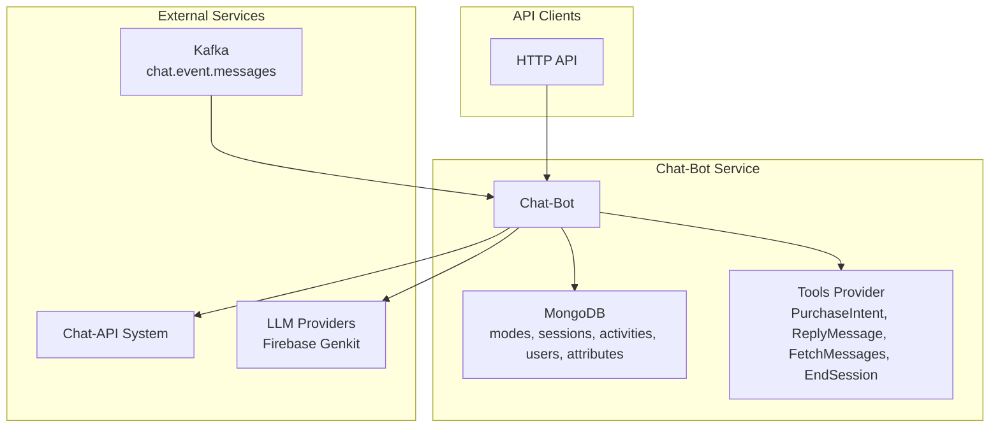
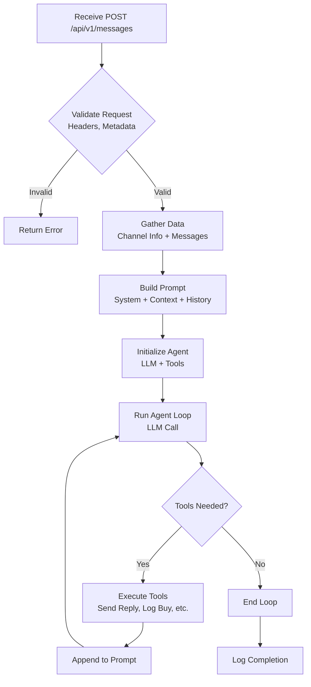
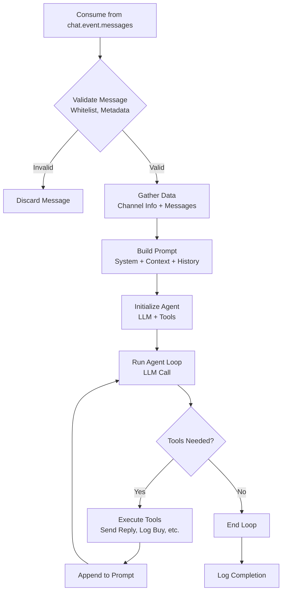

# Chat-Bot Server Architecture

## Overview

The chat-bot server is an extension of the existing chat-search service, implementing a conversational AI agent that acts as a seller in product-selling channels. It integrates with the chat-api for data retrieval and message sending, using Firebase Genkit for Go for LLM-powered conversations with tool-based AI flows.

The system processes messages from two primary sources: a synchronous HTTP API and an asynchronous Kafka topic. It also provides a comprehensive set of RESTful endpoints for managing users and their attributes.

**Key Assumption:** The chat-api does not yet implement the `metadata.llm` part (e.g., `llm.chat_mode`). This will need to be added to the chat-api service separately. For now, the chat-bot will assume these fields exist or provide fallbacks.

## High-Level Architecture



## System Architecture

- **Technology Stack:** Go, Uber FX (dependency injection), Echo (HTTP server), Firebase Genkit for Go (LLM framework), MongoDB 8.0 (database), Golang templates (prompts), Kafka (for event-driven message processing).
- **Layers:**
  - **cmd/** - Application entry point with Cobra CLI framework
  - **internal/app** - Application setup and dependency injection configuration
  - **internal/server** - HTTP server, controllers, and middleware
  - **internal/usecase** - Business logic for message processing, user management, and LLM interactions
  - **internal/repo** - Data access layer with repository implementations:
    - **mongodb/** - MongoDB collections for chat modes, sessions, activities, users, and attributes
    - **chatapi/** - Chat-API client for external communication
    - **chotot/** - Chotot API client for product services
    - **tools/** - LLM tool implementations for conversational AI
    - **toolsmanager/** - Tools orchestration and session management
  - **internal/kafka** - Kafka consumer for asynchronous message processing
  - **internal/models** - Domain models and data transfer objects
  - **internal/config** - Configuration loading and validation
  - **internal/types** - Shared type definitions
  - **pkg/** - Shared utility packages

## Data Flow

The system supports two main data flows for message processing:

### HTTP-based Flow



### Kafka-based Flow



1. Receive new message via API or Kafka.
2. Validate (headers, metadata.llm.mode, channel whitelist for Kafka).
3. Gather data (channel info, message history).
4. Build prompt (system + context + history).
5. Run Genkit AI flow (LLM + tools).
6. Execute tools (send replies, log intents, fetch more data).
7. Repeat until no tools or max iterations.

## Components

- **Chat Modes:** Configurable YAML with templates for customization.
- **Tools:** PurchaseIntent (log), ReplyMessage (API call), FetchMessages (API call), EndSession (terminate), ListProducts (product search).
- **AI Flow:** Iterative LLM calls with tool execution.
- **Validation:** Project ID, mode existence, metadata presence.
- **User Management:** CRUD operations for users and their attributes via a RESTful API.

## Coding Principles & Architecture Patterns

### Layered Architecture

The system implements a clean architecture with strict separation of concerns:

**Import Hierarchy (Top to Bottom):**

```
cmd/ (CLI entry point)
├── internal/app/ (Dependency injection & app lifecycle)
├── internal/server/ (HTTP server, routing, middleware)
├── internal/usecase/ (Business logic & domain rules)
├── internal/repo/ (Data access & external APIs)
│   ├── mongodb/ (Database operations)
│   ├── chatapi/ (External chat API client)
│   ├── chotot/ (Product service client)
│   ├── tools/ (LLM tool implementations)
│   └── toolsmanager/ (Tool orchestration)
├── internal/kafka/ (Async message processing)
├── internal/models/ (Domain entities & DTOs)
├── internal/config/ (Configuration management)
├── internal/types/ (Shared type definitions)
└── pkg/ (Cross-cutting utilities)
```

### Design Patterns

- **Dependency Injection:** Uber FX for clean, testable component wiring
- **Repository Pattern:** Abstract data access behind interfaces
- **CQRS-like Separation:** Usecase layer handles business logic separately from data access
- **Middleware Pattern:** HTTP request/response processing pipeline
- **Observer Pattern:** Kafka consumer reacts to message events

### Code Quality Standards

- **Single Responsibility:** Files under 500 lines, functions under 25 lines
- **DRY Principle:** Extract common logic, avoid duplication
- **Configuration Management:** No hard-coded values, environment-based config
- **Error Handling:** Explicit error propagation, structured logging
- **Testing Strategy:** Unit tests with mocks, integration tests for critical flows
- **Documentation:** Self-documenting code, API documentation for public interfaces

## Integration Points

- **Chat-API:** GET/POST endpoints for data and sending.
- **Kafka:** Consumes from `chat.event.messages` topic for asynchronous message processing.
- **LLM:** Via Firebase Genkit for Go, supporting multiple providers.
- **Configs:** Environment variables for keys, MongoDB for modes and sessions.

## Scalability & Reliability

- The system supports both synchronous (HTTP) and asynchronous (Kafka) processing.
- The Kafka consumer allows for scalable, resilient, and decoupled message processing.
- Error handling with logging and retries.
- Monitoring via existing middleware.

## Future Extensions

- Add more tools (e.g., product search).
- Implement metadata in chat-api.
- Add vector stores for context (using existing search infra).
