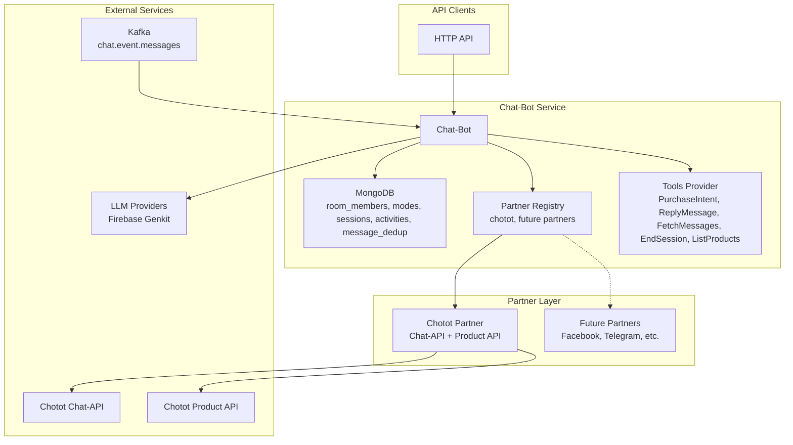

# Chat-Bot Server Architecture

## Overview

The chat-bot server is a conversational AI service that acts as an intelligent seller in product-selling rooms across multiple messaging platforms. It features a **partner abstraction layer** supporting Chotot's chat-api and is designed for future expansion to Facebook Messenger and other platforms.

The system uses **Firebase Genkit for Go** for LLM-powered conversations with tool-based AI flows and implements a **denormalized room architecture** using a single enhanced RoomMember collection for optimal performance.

The system processes messages from two primary sources: a synchronous HTTP API and an asynchronous Kafka topic, with built-in **message deduplication** and **loop prevention** mechanisms.

## High-Level Architecture



## System Architecture

- **Technology Stack:** Go 1.25, Uber FX (dependency injection), Echo (HTTP server), Firebase Genkit for Go (LLM framework), MongoDB 8.0 (database), Golang templates (prompts), Kafka (for event-driven message processing), React frontend with TypeScript, Node.js Socket.IO server.
- **Key Architecture Changes:**
  - **Partner Abstraction Layer** - Unified interface for multiple messaging platforms
  - **Enhanced RoomMember Model** - Denormalized single collection design
  - **Message Deduplication** - Loop prevention with external message ID tracking
- **Layers:**
  - **cmd/** - Application entry point with Cobra CLI framework
  - **internal/app** - Application setup and dependency injection configuration
  - **internal/server** - HTTP server, controllers, and middleware
  - **internal/usecase** - Business logic for message processing, user management, and LLM interactions
  - **internal/repo** - Data access layer with repository implementations:
    - **mongodb/** - MongoDB repositories for room_members, messages, sessions, etc.
    - **partners/** - Partner abstraction layer (registry, chotot, facebook)
    - **chatapi/** - Chat-API client (legacy, now via Chotot partner)
    - **chotot/** - Chotot API client for product services
    - **tools/** - LLM tool implementations for conversational AI
    - **toolsmanager/** - Tools orchestration and session management
  - **internal/kafka** - Kafka consumer for asynchronous message processing
  - **internal/models** - Domain models and data transfer objects
  - **internal/config** - Configuration loading and validation
  - **pkg/** - Shared utility packages
  - **web/** - React frontend application with TypeScript
  - **socket/** - Node.js Socket.IO server for real-time communication

## Data Flow

The system supports two main data flows for message processing:

### HTTP-based Flow


### Kafka-based Flow


1. Receive new message via API or Kafka.
2. Validate (headers, metadata.llm.mode, room whitelist for Kafka).
3. Gather data (room info, message history).
4. Build prompt (system + context + history).
5. Run Genkit AI flow (LLM + tools).
6. Execute tools (send replies, log intents, fetch more data).
7. Repeat until no tools or max iterations.

## Components

### Core Components

- **Partner Registry:** Manages multiple messaging platform integrations with partner detection
- **Enhanced RoomMember Collection:** Single denormalized collection for rooms, members, and unread counts
- **Chat Modes:** MongoDB-based configurations with Go template prompts for customization
- **Message Deduplication:** Loop prevention using external message ID tracking
- **Tools:** PurchaseIntent (log), ReplyMessage (partner-specific), FetchMessages (partner-specific), EndSession (terminate), ListProducts (product search)
- **AI Flow:** Iterative LLM calls with tool execution via Firebase Genkit
- **User Management:** CRUD operations for users and their attributes via RESTful API

### Partner Implementations

- **Chotot Partner:** Unified integration with Chotot's chat-api and product services (✅ Implemented)
- **Future Partners:** Framework ready for Facebook Messenger, Telegram, WhatsApp, etc.

## Coding Principles & Architecture Patterns

### Layered Architecture

The system implements a clean architecture with strict separation of concerns:

**Import Hierarchy (Top to Bottom):**

```
cmd/ (CLI entry point)
├── internal/app/ (Dependency injection & app lifecycle)
├── internal/server/ (HTTP server, routing, middleware)
├── internal/usecase/ (Business logic & domain rules)
├── internal/repo/ (Data access & external APIs)
│   ├── mongodb/ (Database operations - room_members, messages, etc.)
│   ├── partners/ (Partner abstraction - registry, chotot implementation)
│   ├── chatapi/ (Legacy chat API client, now via Chotot partner)
│   ├── chotot/ (Product service client)
│   ├── tools/ (LLM tool implementations)
│   └── toolsmanager/ (Tool orchestration)
├── internal/kafka/ (Async message processing with deduplication)
├── internal/models/ (Domain entities & DTOs)
├── internal/config/ (Configuration management)
└── pkg/ (Cross-cutting utilities)
```

### Design Patterns

- **Dependency Injection:** Uber FX for clean, testable component wiring
- **Repository Pattern:** Abstract data access behind interfaces
- **Partner Abstraction Pattern:** Unified interface for multiple messaging platforms
- **Denormalized Data Pattern:** Single RoomMember collection for optimal read performance
- **CQRS-like Separation:** Usecase layer handles business logic separately from data access
- **Middleware Pattern:** HTTP request/response processing pipeline
- **Observer Pattern:** Kafka consumer reacts to message events with deduplication

### Code Quality Standards

- **Single Responsibility:** Files under 500 lines, functions under 25 lines
- **DRY Principle:** Extract common logic, avoid duplication
- **Configuration Management:** No hard-coded values, environment-based config
- **Error Handling:** Explicit error propagation, structured logging
- **Testing Strategy:** Unit tests with mocks, integration tests for critical flows
- **Documentation:** Self-documenting code, API documentation for public interfaces

## Integration Points

### Current Integrations

- **Chotot Partner:** Unified access to Chotot's chat-api and product services
- **Kafka:** Consumes from `chat.event.messages` topic with partner-based filtering and deduplication
- **Firebase Genkit:** LLM orchestration with tool-based AI flows supporting multiple providers
- **MongoDB:** Configurations in database (modes, sessions) and denormalized room_members collection

### Partner-Specific Integrations

- **Chotot Chat-API:** Room info, message history, and message sending
- **Chotot Product API:** Product listings and user product fetching
- **Future Partners:** Framework ready for Facebook Messenger, Telegram, etc.

## Scalability & Reliability

### Performance Optimizations

- **Denormalized Architecture:** Single RoomMember collection eliminates expensive joins and aggregations
- **Partner Abstraction:** Efficient partner detection and routing reduces overhead
- **Message Deduplication:** Prevents infinite loops and duplicate processing

### Resilience Features

- **Synchronous and Asynchronous Processing:** HTTP API and Kafka consumer support
- **Partner Health Checks:** Built-in health monitoring for all registered partners
- **Error Handling:** Structured logging, retries, and graceful degradation
- **Loop Prevention:** External message ID tracking prevents message processing loops

## Future Extensions

### Platform Expansion
- **Facebook Messenger Integration:** Complete Facebook partner implementation
- **Telegram/WhatsApp Support:** Additional messaging platform partners
- **Multi-platform Room Bridging:** Cross-platform conversation continuity

### Feature Enhancements
- **Advanced Product Search Tools:** Enhanced product discovery and recommendation
- **Vector Store Integration:** Context-aware conversations using existing search infrastructure
- **Real-time Notifications:** WebSocket-based instant messaging updates
- **Analytics Dashboard:** Partner performance metrics and conversation insights

### Architecture Improvements
- **Async AI Processing:** Background LLM processing for improved scalability
- **Message Routing Optimization:** Smart partner selection and load balancing
- **Advanced Deduplication:** Content-based duplicate detection beyond external IDs
