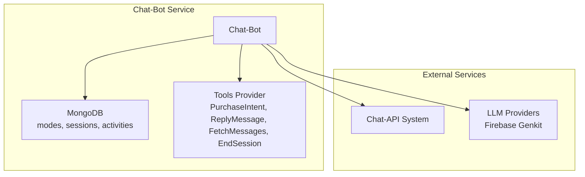
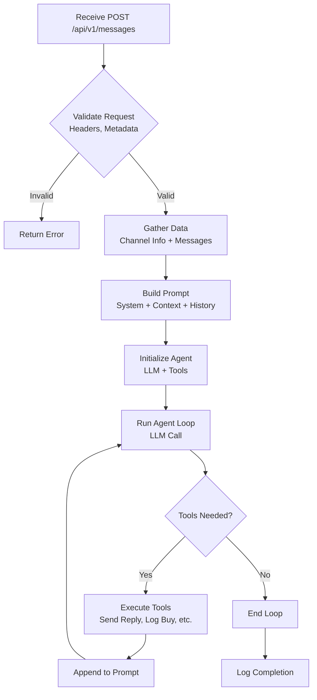

# Chat-Bot Server Architecture

## Overview

The chat-bot server is an extension of the existing chat-search service, implementing a conversational AI agent that acts as a seller in product-selling channels. It integrates with the chat-api for data retrieval and message sending, using Firebase Genkit for Go for LLM-powered conversations with tool-based AI flows.

**Key Assumption:** The chat-api does not yet implement the `metadata.llm` part (e.g., `llm.chat_mode`). This will need to be added to the chat-api service separately. For now, the chat-bot will assume these fields exist or provide fallbacks.

## High-Level Architecture

## System Architecture

- **Technology Stack:** Go, Uber FX (dependency injection), Echo (HTTP server), Firebase Genkit for Go (LLM framework), MongoDB 8.0 (database), Golang templates (prompts).
- **Layers:**
  - **Config:** MongoDB-based chat modes (project_id, model, tools, system_prompt template, etc.).
  - **API:** HTTP endpoints (e.g., POST `/api/v1/messages`).
  - **Usecase:** Business logic for message processing.
  - **Repository:** External API clients (chat-api).
- **External Dependencies:** Chat-api (for messages/channel info), LLM providers (OpenAI, etc.).

## Data Flow

1. Receive new message via API.
2. Validate (headers, metadata.llm.mode).
3. Gather data (channel info, message history).
4. Build prompt (system + context + history).
5. Run Genkit AI flow (LLM + tools).
6. Execute tools (send replies, log intents, fetch more data).
7. Repeat until no tools or max iterations.

## Components

- **Chat Modes:** Configurable YAML with templates for customization.
- **Tools:** PurchaseIntent (log), ReplyMessage (API call), FetchMessages (API call), EndSession (terminate).
- **AI Flow:** Iterative LLM calls with tool execution.
- **Validation:** Project ID, mode existence, metadata presence.

## Integration Points

- **Chat-API:** GET/POST endpoints for data and sending.
- **LLM:** Via Firebase Genkit for Go, supporting multiple providers.
- **Configs:** Environment variables for keys, MongoDB for modes and sessions.

## Scalability & Reliability

- Synchronous processing per request; consider async for scale.
- Error handling with logging and retries.
- Monitoring via existing middleware.

## Future Extensions

- Add more tools (e.g., product search).
- Implement metadata in chat-api.
- Add vector stores for context (using existing search infra).
