# Data Flow and Message Processing

## Table of Contents

- [Overview](#overview)
- [Message Input Sources](#message-input-sources)
- [HTTP API Message Flow](#http-api-message-flow)
- [Kafka Consumer Message Flow](#kafka-consumer-message-flow)
- [Partner Abstraction Flow](#partner-abstraction-flow)
- [LLM Processing Pipeline](#llm-processing-pipeline)
- [Tool Execution Flows](#tool-execution-flows)
- [Error Handling & Recovery](#error-handling--recovery)

## Overview

The Chat-Bot system processes messages through two primary channels with built-in **loop prevention** and **partner abstraction**. Both flows converge at the LLM processing pipeline, ensuring consistent conversation handling regardless of input source.

### Key Flow Characteristics

- **Dual Input Processing**: HTTP API (synchronous) and Kafka consumer (asynchronous)
- **Partner Abstraction**: Unified partner detection and routing
- **Loop Prevention**: Internal user identification prevents infinite loops
- **Tool-Based AI**: Iterative LLM calls with tool execution
- **Session Management**: Complete conversation lifecycle tracking

## Message Input Sources

## HTTP API Message Flow

### Flowchart - HTTP Message Processing

### Sequence Diagram - HTTP Message Processing

## Kafka Consumer Message Flow

### Flowchart - Kafka Message Processing

### Sequence Diagram - Kafka Message Processing

## Partner Abstraction Flow

### Partner Detection and Routing

### Current and Future Partner Support

## LLM Processing Pipeline

### AI Agent Execution Flow

### Chat Mode Configuration Flow

## Tool Execution Flows

### Available Tools and Their Functions

### Tool Execution Sequence

### ReplyMessage Tool Flow

### PurchaseIntent Tool Flow

```mermaid
flowchart TD
    A[PurchaseIntent Tool Called] --> B[Extract Intent Parameters<br/>from LLM Analysis]
    B --> C[Parse Intent Data<br/>Item, Price, Confidence]

    C --> D[Validate Intent Strength<br/>Percentage Threshold Check]
    D --> E{Strong Intent?}
    E -->|< 50%| F[Log as Low Intent<br/>Continue Monitoring]
    E -->|≥ 50%| G[Create Purchase Intent Record]

    G --> H[Store in MongoDB<br/>purchase_intents Collection]
    H --> I[Update Session Analytics<br/>Mark High-Value Session]

    F --> J[Log Chat Activity<br/>Intent: interest]
    I --> K[Log Chat Activity<br/>Intent: strong_buy_signal]

    J --> L[Return to LLM<br/>Continue Conversation]
    K --> M[Return to LLM<br/>Consider Follow-up Actions]

    style A fill:#e1f5fe
    style E fill:#fff3e0
    style F fill:#fff8e1
    style G fill:#e8f5e8
    style L fill:#e1f5fe
    style M fill:#e8f5e8
```

## Error Handling & Recovery

### Error Classification and Recovery Strategies

### Message Deduplication Prevention

The data flow architecture ensures robust, scalable message processing with comprehensive error handling and partner abstraction, supporting both current operations and future platform expansion.