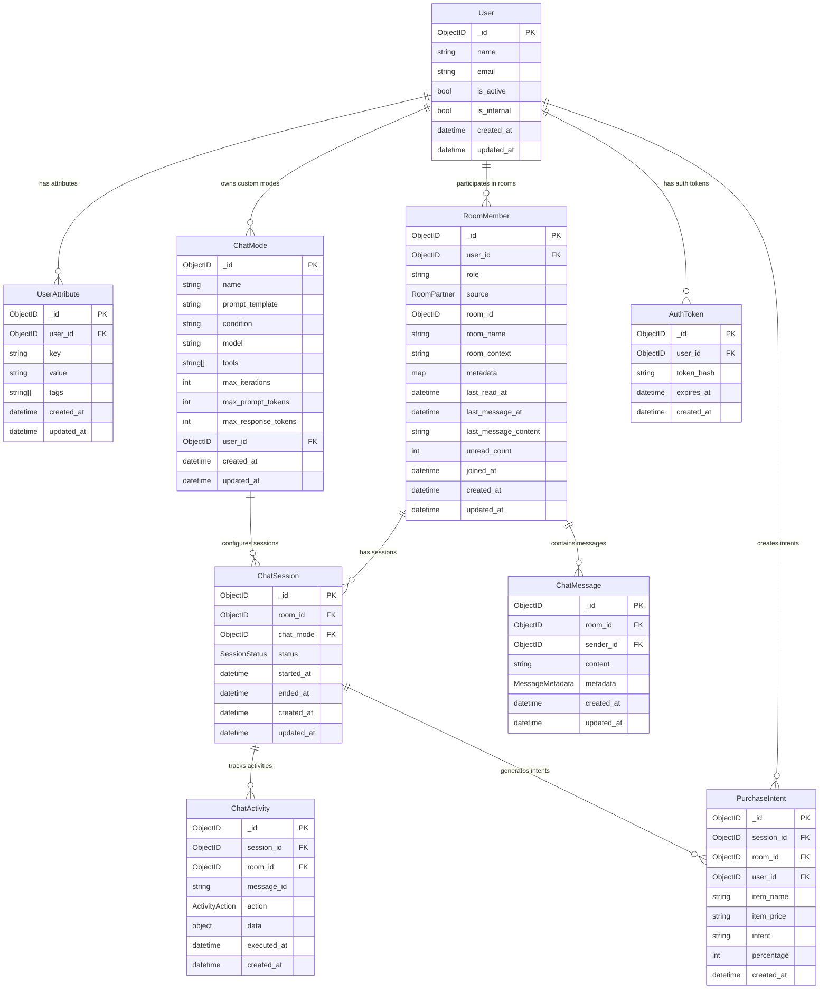
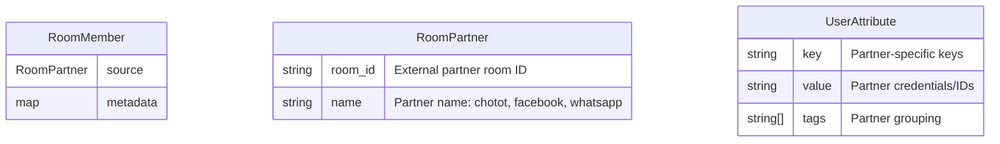

# Entity Relationship Diagrams (ERD)

## Table of Contents

- [Overview](#overview)
- [Core Data Model](#core-data-model)
- [Collection Relationships](#collection-relationships)
- [MongoDB Collections](#mongodb-collections)
- [Partner Integration Schema](#partner-integration-schema)
- [Authentication & Session Schema](#authentication--session-schema)
- [Chat & Messaging Schema](#chat--messaging-schema)
- [Data Constraints & Indexes](#data-constraints--indexes)

## Overview

The Chat-Bot system uses MongoDB with a **denormalized architecture** optimized for read performance. The core design principle is the **single RoomMember collection** that eliminates expensive joins and aggregations by storing denormalized room and member data together.

### Key Design Principles

1. **Denormalization for Performance**: Single RoomMember collection contains room info + member data
2. **Partner Abstraction**: Unified schema supporting multiple messaging platforms
3. **Session Tracking**: Complete conversation lifecycle management
4. **Loop Prevention**: Internal user identification to prevent processing loops

## Core Data Model



## Collection Relationships

### Primary Collections

| Collection         | Purpose                          | Key Relationships                                  |
| ------------------ | -------------------------------- | -------------------------------------------------- |
| `users`            | User management and profiles     | → `user_attributes`, `room_members`                |
| `user_attributes`  | Partner-specific user data       | ← `users`                                          |
| `room_members`     | **Core denormalized collection** | ← `users`, → `chat_sessions`, `chat_messages`      |
| `chat_modes`       | LLM configuration templates      | ← `users`, → `chat_sessions`                       |
| `chat_sessions`    | Conversation lifecycle tracking  | ← `room_members`, `chat_modes` → `chat_activities` |
| `chat_activities`  | Action and tool execution logs   | ← `chat_sessions`                                  |
| `purchase_intents` | Buy signal analytics             | ← `chat_sessions`, `users`, `room_members`         |
| `auth_tokens`      | JWT token management             | ← `users`                                          |
| `chat_messages`    | Message storage                  | ← `room_members`, `users`                          |

## MongoDB Collections

### Users Collection (`users`)

```javascript
{
  "_id": ObjectID,
  "name": "John Merchant",
  "email": "john@example.com",
  "is_active": true,
  "is_internal": false,
  "created_at": ISODate("2024-01-01T00:00:00Z"),
  "updated_at": ISODate("2024-01-01T00:00:00Z")
}
```

**Indexes:**

- `{"email": 1}` (unique)
- `{"is_active": 1, "created_at": -1}`

### User Attributes Collection (`user_attributes`)

```javascript
{
  "_id": ObjectID,
  "user_id": ObjectID("user_reference"),
  "key": "chotot_id",
  "value": "merchant123",
  "tags": ["chotot", "primary"],
  "created_at": ISODate("2024-01-01T00:00:00Z"),
  "updated_at": ISODate("2024-01-01T00:00:00Z")
}
```

**Partner Attribute Keys:**

- `chotot_id`: Chotot user identifier
- `chotot_oid`: Chotot organization ID
- `whatsapp_phone_number_id`: WhatsApp Business phone number
- `whatsapp_system_token`: WhatsApp API token (sensitive)

**Indexes:**

- `{"user_id": 1, "key": 1}` (unique compound)
- `{"tags": 1}`

### Room Members Collection (`room_members`) - Core Denormalized Design

```javascript
{
  "_id": ObjectID,
  "user_id": ObjectID("user_reference"),
  "role": "merchant",                    // "merchant", "buyer", "agent"

  // Denormalized room information
  "source": {
    "room_id": "chotot_room_123",        // External partner room ID
    "name": "chotot"                     // Partner name
  },
  "room_id": ObjectID("internal_room_id"),
  "room_name": "iPhone 12 Pro Discussion",
  "room_context": "Selling iPhone 12 Pro 256GB",
  "metadata": {
    "item_name": "iPhone 12 Pro",
    "item_price": "$899",
    "item_id": "item_456"
  },

  // Member-specific data
  "last_read_at": ISODate("2024-01-01T10:30:00Z"),
  "last_message_at": ISODate("2024-01-01T10:35:00Z"),
  "last_message_content": "Is this still available?",
  "unread_count": 3,

  // Timestamps
  "joined_at": ISODate("2024-01-01T09:00:00Z"),
  "created_at": ISODate("2024-01-01T09:00:00Z"),
  "updated_at": ISODate("2024-01-01T10:35:00Z")
}
```

**Key Benefits of Denormalization:**

- **Single Query Performance**: Get complete room + member data in one query
- **No Expensive Joins**: Eliminates need for aggregation pipelines
- **Optimized for Reads**: Chat applications are read-heavy
- **Unread Count Efficiency**: Direct field access vs. message counting

**Indexes:**

- `{"user_id": 1, "updated_at": -1}` (user's rooms by activity)
- `{"room_id": 1, "user_id": 1}` (unique membership)
- `{"source.name": 1, "source.room_id": 1}` (partner room lookup)
- `{"unread_count": 1}` (unread filtering)

## Partner Integration Schema

### Partner Data Structure



### Partner-Specific Schemas

#### Chotot Integration

```javascript
// RoomMember.source
{
  "room_id": "chotot_room_12345",
  "name": "chotot"
}

// RoomMember.metadata
{
  "item_name": "iPhone 12 Pro Max",
  "item_price": "23990000",
  "item_id": "ct_item_789",
  "category": "phones"
}

// UserAttribute entries
{
  "key": "chotot_id",
  "value": "user12345",
  "tags": ["chotot", "primary"]
},
{
  "key": "chotot_oid",
  "value": "org67890",
  "tags": ["chotot", "organization"]
}
```

#### WhatsApp Integration (Future)

```javascript
// RoomMember.source
{
  "room_id": "whatsapp_chat_uuid",
  "name": "whatsapp"
}

// UserAttribute entries
{
  "key": "whatsapp_phone_number_id",
  "value": "+1234567890",
  "tags": ["whatsapp", "phone"]
},
{
  "key": "whatsapp_system_token",
  "value": "encrypted_token_hash",
  "tags": ["whatsapp", "sensitive", "auth"]
}
```

## Authentication & Session Schema

### Auth Tokens Collection (`auth_tokens`)

```javascript
{
  "_id": ObjectID,
  "user_id": ObjectID("user_reference"),
  "token_hash": "sha256_hash_of_jwt_token",
  "expires_at": ISODate("2024-01-08T00:00:00Z"),
  "created_at": ISODate("2024-01-01T00:00:00Z")
}
```

**Indexes:**

- `{"token_hash": 1}` (unique)
- `{"user_id": 1, "expires_at": -1}`
- `{"expires_at": 1}` (TTL index for auto-cleanup)

### Chat Modes Collection (`chat_modes`)

```javascript
{
  "_id": ObjectID,
  "name": "product_sales_assistant",
  "prompt_template": "You are a helpful sales assistant for {{.ItemName}}...",
  "condition": "metadata.item_name != null",
  "model": "gemini-1.5-pro",
  "tools": ["PurchaseIntent", "ReplyMessage", "ListProducts"],
  "max_iterations": 10,
  "max_prompt_tokens": 4000,
  "max_response_tokens": 1000,
  "user_id": ObjectID("optional_custom_mode"),
  "created_at": ISODate("2024-01-01T00:00:00Z"),
  "updated_at": ISODate("2024-01-01T00:00:00Z")
}
```

**Indexes:**

- `{"name": 1}` (unique)
- `{"user_id": 1}` (custom modes)
- `{"condition": 1}` (mode matching)

## Chat & Messaging Schema

### Chat Sessions Collection (`chat_sessions`)

```javascript
{
  "_id": ObjectID,
  "room_id": ObjectID("room_reference"),
  "chat_mode": ObjectID("chat_mode_reference"),
  "status": "active",                    // "active", "ended", "abandoned"
  "started_at": ISODate("2024-01-01T10:00:00Z"),
  "ended_at": null,
  "created_at": ISODate("2024-01-01T10:00:00Z"),
  "updated_at": ISODate("2024-01-01T10:00:00Z")
}
```

**Indexes:**

- `{"room_id": 1, "status": 1, "started_at": -1}`
- `{"status": 1, "updated_at": -1}`

### Chat Activities Collection (`chat_activities`)

```javascript
{
  "_id": ObjectID,
  "session_id": ObjectID("session_reference"),
  "room_id": ObjectID("room_reference"),
  "message_id": "external_msg_123",
  "action": "reply_message",             // Tool action types
  "data": {
    "message": "Thanks for your interest!",
    "tool_result": "success",
    "execution_time_ms": 245
  },
  "executed_at": ISODate("2024-01-01T10:05:00Z"),
  "created_at": ISODate("2024-01-01T10:05:00Z")
}
```

**Activity Action Types:**

- `purchase_intent`: Buy signal detected
- `reply_message`: Message sent to user
- `fetch_messages`: History retrieved
- `list_products`: Product search performed

**Indexes:**

- `{"session_id": 1, "executed_at": -1}`
- `{"room_id": 1, "action": 1, "executed_at": -1}`

### Purchase Intents Collection (`purchase_intents`)

```javascript
{
  "_id": ObjectID,
  "session_id": ObjectID("session_reference"),
  "room_id": ObjectID("room_reference"),
  "user_id": ObjectID("buyer_user_reference"),
  "item_name": "iPhone 12 Pro Max",
  "item_price": "23990000",
  "intent": "strong_buy_signal",
  "percentage": 85,                      // Confidence percentage
  "created_at": ISODate("2024-01-01T10:15:00Z")
}
```

**Intent Types:**

- `interest`: Initial product inquiry
- `price_negotiation`: Price discussion
- `strong_buy_signal`: High purchase probability
- `purchase_confirmed`: Explicit buy confirmation

**Indexes:**

- `{"session_id": 1, "created_at": -1}`
- `{"user_id": 1, "intent": 1, "created_at": -1}`
- `{"percentage": -1, "created_at": -1}` (high-intent analysis)

## Data Constraints & Indexes

### Performance Optimization Indexes

```javascript
// Room member queries (most common)
db.room_members.createIndex({ user_id: 1, updated_at: -1 });
db.room_members.createIndex({ room_id: 1, user_id: 1 }, { unique: true });

// Partner-specific lookups
db.room_members.createIndex({ 'source.name': 1, 'source.room_id': 1 });

// Chat session tracking
db.chat_sessions.createIndex({ room_id: 1, status: 1, started_at: -1 });

// Activity analytics
db.chat_activities.createIndex({ action: 1, executed_at: -1 });
db.purchase_intents.createIndex({ percentage: -1, created_at: -1 });

// Authentication
db.auth_tokens.createIndex({ token_hash: 1 }, { unique: true });
db.auth_tokens.createIndex({ expires_at: 1 }, { expireAfterSeconds: 0 });
```

### Data Validation Rules

1. **User Email Uniqueness**: Enforced at application and database level
2. **Room Membership Uniqueness**: One user per room (user_id + room_id unique)
3. **Partner Attribute Keys**: Validated against allowed partner attribute constants
4. **Session Status Transitions**: State machine validation in application layer
5. **Internal User Flags**: `users.is_internal` used for loop prevention in message processing
6. **TTL Cleanup**: Automatic expiration for auth tokens

### Backup & Migration Considerations

1. **Denormalized Data Consistency**: Room info updates require multi-document updates
2. **Partner Migration**: User attributes enable smooth partner transitions
3. **Message History**: Separate collection allows independent retention policies
4. **Session Analytics**: Time-series nature enables efficient archival strategies

The ERD design prioritizes read performance through denormalization while maintaining referential integrity through application-level constraints and strategic indexing.
